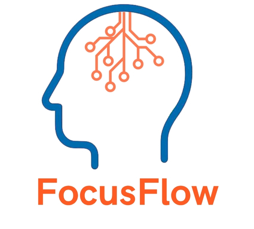

<p align="center">
  
</p>

# FocusFlow

Yapay zeka destekli **öğrenme planlayıcınız**: Hedeflerinize uygun, akıllı ve kişiselleştirilmiş bir eğitim deneyimi.

**Proje Tüzüğü:** [Proje Tüzüğü (PDF)](./ProjectFiles/FocusFlowProjeTüzüğü.pdf)

**FocusFlow Tanıtım Videosu:** [Tanıtım Videosu](https://www.youtube.com/watch?v=BB0J-Gso63c&ab_channel=EmreSayg%C4%B1n)

**Sprint Planları:** [Sprint Planları](https://github.com/YZTA-Bootcamp-102/AIStudyPlanner/blob/ai-destekli-haftalik-retrospektif/ProjectFiles/SprintPlanlar%C4%B1.pdf)

**Product Backlog User Storyleri:** [Product Backlog User Storyleri](https://github.com/YZTA-Bootcamp-102/AIStudyPlanner/blob/ai-destekli-haftalik-retrospektif/ProjectFiles/userstory.pdf)

---

## İçindekiler
- [Proje Açıklaması](#proje-açıklaması)
- [Proje Amacı](#proje-amacı)
- [Proje Ekibi](#proje-ekibi)
- [Özellikler](#özellikler)
- [Kullanılan Teknolojiler](#kullanılan-teknolojiler)
- [Temel Özellikler](#temel-özellikler)
- [Sprint Planı](#sprint-planı)
- [Klasör Yapısı](#klasör-yapısı)
- [Proje Linkleri](#proje-linkleri)
- [Notlar](#notlar)

---

## Proje Açıklaması

**FocusFlow**, kullanıcıların kişisel öğrenme hedeflerine ulaşmalarını sağlamak amacıyla, yapay
 zeka destekli, kişiselleştirilmiş öğrenme planları sunan, görev yönetimi ve ilerleme
 takibi özelliklerine sahip bir dijital platformdur.

---

## Proje Amacı

**Bu projenin amacı**; bireylerin ya da ekiplerin öğrenme ve gelişim süreçlerini sistematik olarak takip etmelerini sağlamak ve yapay zeka desteğiyle bu süreci optimize etmektir. 

Kullanıcılar, günlük olarak AI tarafından oluşturulan planlara göre çalışır; takvim entegrasyonu sayesinde hatırlatmalar alır ve ilerlemelerini gerçek zamanlı takip edebilir.

---

## Proje Ekibi

| İsim Soyisim | Rol | Profil |
|----------------------|---------------|-----------|
| **Miray Tepe** | Scrum Master / Backend Developer / AI Developer | [](https://github.com/MirayTepe) [](https://www.linkedin.com/in/miraytepe/) |
| **Mehmet Can Ergüden** | Product Owner / Frontend Developer | [](https://github.com/mehmeterguden) [](https://www.linkedin.com/in/mehmeterguden/) |
| **Emre Saygın** | Database Developer / Backend Developer / AI Developer | [](https://github.com/emresaygin59) [](https://www.linkedin.com/in/emresaygin/) |


---

## Özellikler

### AI Destekli Eğitim Modülü ve Günlük Planlama
- Öğrenme hedeflerine göre **kişiye özel günlük plan** oluşturulur.

### Takvim Entegrasyonu ve Hatırlatmalar
- Google Takvim gibi platformlara **otomatik görev ekleme**.
- Belirli saatlerde **bildirimlerle motivasyon artırımı**.

### Günlük Görev Takibi ve Performans Analizi
- Kullanıcının tamamladığı görevler **AI destekli analizle** değerlendirilir.
- **Gelişim raporları** sunulur.

### Akıllı Yönlendirme ve Çalışma İpuçları
- Kullanıcının davranış ve performansına göre **odak artırıcı öneriler** ve **öğrenme teknikleri** sağlanır.

---

## Kullanılan Teknolojiler

| Teknoloji Kategorisi | Teknolojiler |
|----------------------|--------------|
| Backend | Python |
| Frontend | React TypeScript |
| Veritabanı | PostgreSQL |
| Yapay Zekâ Kütüphaneleri | Gemini |

---

## Temel Özellikler

| Özellik Başlığı | Açıklama |
|------------------|----------|
| Kişiselleştirilmiş Öğrenme : Hedef Odaklı Planlama | Kullanıcı hedef ve ilgi alanlarına dayalı kişiselleştirilmiş öğrenme planı oluşturma. |Kullanıcının ilgi ve hedeflerine göre özelleştirilmiş öğrenme planları oluşturulur ve günlük/sprint bazında görev takibi yapılır.|
|Verimli Takip ve Hatırlatmalar : Google Takvim Entegrasyonu | Öğrenme görevleri ve planları Google Takvim ile sorunsuz entegre edilerek bildirim ve hatırlatmalarla takip kolaylığı sağlanır.|
| Yapay Zeka Destekli Gelişim: İpuçları ve Analizler | Yapay zeka tabanlı ipuçları ve retrospektif analizlerle öğrenme ilerlemesi görselleştirilip raporlanırken, kullanıcı dostu bir arayüz sunulur. |

---

## Sprint Planı

| Sprint | Tarih Aralığı | Dosya Yolu |
|--------|---------------|------------|
| [Sprint 1](./sprintOne/README.md) |20.06 - 06.07 |`./bootcampFiles/sprintOne/` |
| [Sprint 2](./sprintTwo/README.md) | 07.07 - 20.07 |`./bootcampFiles/sprintTwo/` |
| [Sprint 3](https://github.com/YZTA-Bootcamp-102/AIStudyPlanner/blob/ai-destekli-haftalik-retrospektif/sprintThree%2FREADME.md)| 21.07 - 03.08 | `./bootcampFiles/sprintThree/` |

---

## Klasör Yapısı

```

AIStudyPlanner/
│
├── bootcampFiles/
│   ├── sprintOne/
│   ├── sprintTwo/
│   └── sprintThree/
│
├── backend/
├── frontend/
└── README.md

```

---

## Proje Linkleri

| Platform | Link |
|----------|------|
| GitHub | [https://github.com/YZTA-Bootcamp-102/AIStudyPlanner/](https://github.com/YZTA-Bootcamp-102/AIStudyPlanner/) |
| Trello | - [https://trello.com/b/rYb67cj1/kanban-template](https://trello.com/b/rYb67cj1/kanban-template) |
| Demo | - |
| Dokümantasyon | - |

---

## Notlar

- İçerikler ekip tarafından güncellenecektir.

---
