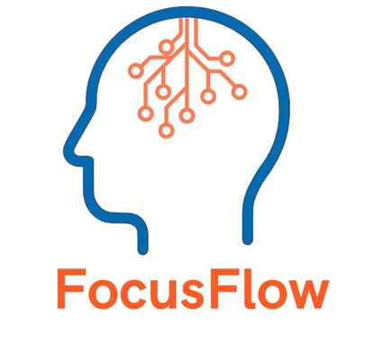
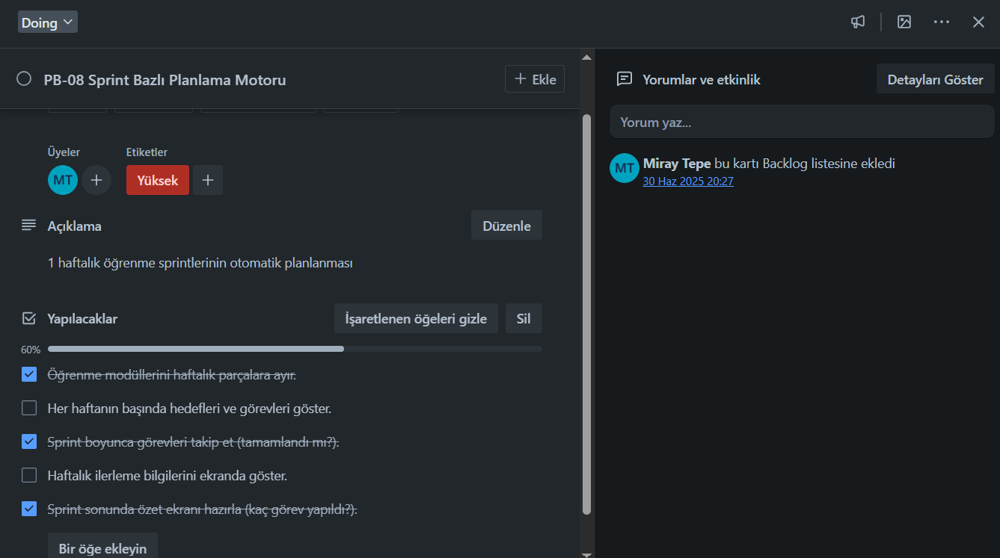
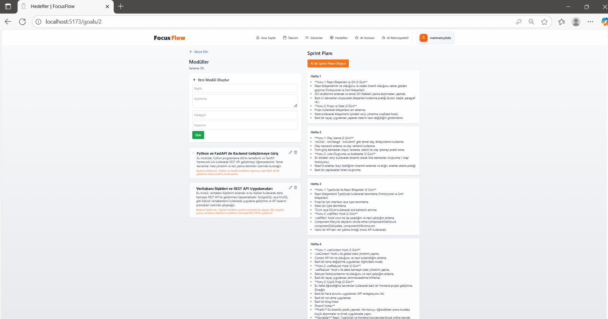
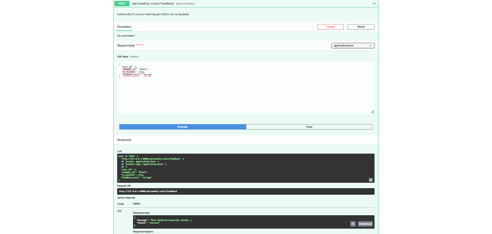

  

# FocusFlow Sprint Raporu 3

---

**Sprint Tarihi:** 20.07.2025/03.08.2025 

**Kullanılan Araç:** **Trello** – [Trello Sprint Board](https://trello.com/b/rYb67cj1/kanban-template)  

**Sprint Hedefi:** Bu sprintte, kullanıcılarımızın **yapay zeka destekli üretkenlik ve öğrenme araçlarıyla deneyimlerini bir üst seviyeye taşımaya** odaklandık. Temel hedefimiz, kullanıcılarımıza özel, akıllı ve kişiselleştirilmiş destek sunarak öğrenme ve görev yönetimini daha verimli hale getirmekti. Ayrıca, önceki sprintten kalan **bazı backend ve frontend entegrasyonlarını** da tamamlamayı hedefledik. Bu hedefler doğrultusunda üzerinde çalıştığımız backlog öğeleri ise şunlardır:

- **PB-06: AI Çalışma İpuçları:** Yapay zeka destekli, kişiselleştirilmiş çalışma ve öğrenme ipuçları sunulması.
- **PB-08: Sprint Bazlı Planlama Motoru:** Sprint bazlı görev ve öğrenme planlamasını optimize eden bir motorun geliştirilmesi.
- **PB-09: AI Destekli Haftalık Retrospektif:** Yapay zeka ile haftalık retrospektif analizi yaparak iyileştirme alanlarının belirlenmesi.

---

## İçindekiler
- [Sprint Notları](#sprint-notları)
- [Tahmin Edilen Tamamlanacak Puan](#tahmin-edilen-tamamlanacak-puan)
- [Tahmin Mantığı](#tahmin-mantığı)
- [Daily Scrum Notları](#daily-scrum-notları)
- [Sprint Board Durumu](#sprint-board-durumu)
- [Ekran Görüntüleri](#ekran-görüntüleri)
- [Sprint Review](#sprint-review)
- [Sprint Retrospective](#sprint-retrospective)
-----

### Sprint Notları

Bu sprintte, yapay zeka destekli yeni özelliklerin geliştirilmesi üzerine odaklanarak önemli ilerlemeler kaydettik. Her bir backlog maddesi için teknik detaylar ve kaydedilen başarılar aşağıda açıklanmaktadır. Genel olarak, fonksiyonların çoğu arka uçta tamamlanmış olup, ön uç entegrasyonları üzerinde son rötuşlar yapılmaktadır.

- **Önceki Sprint Entegrasyonları**

**Açıklama:** Günlük Görev Planlayıcısı için arayüzde görevlerin gün bazlı görüntülenmesi ve Takvim Entegrasyonu için ön uç ile arka uç arasındaki bağlantıların tamamlanması.

**Durum:** Günlük Görev Planlayıcısı'nda görevlerin arayüzde gün bazlı görselleştirilmesi başarılı bir şekilde tamamlandı. Kullanıcılar artık görevlerini daha düzenli bir takvim görünümünde takip edebiliyor. Ayrıca, Takvim Entegrasyonu için bekleyen ön uç ve arka uç entegrasyonları da bu sprintte eksiksiz olarak tamamlandı. Böylece, Google Takvim ile senkronizasyon sorunsuz bir şekilde çalışır hale geldi.

- **PB-06: AI Çalışma İpuçları**

**Açıklama:** Yapay zeka destekli, kişiselleştirilmiş çalışma ve öğrenme ipuçları sunulması.

**Durum:** Kullanıcının geçmiş performans verileri ve öğrenme alışkanlıklarına dayalı kişiselleştirilmiş ipuçları üreten AI modeli geliştirildi. Bu ipuçlarının kullanıcı arayüzünde gösterilmesi için gerekli API uçları hazırlandı ve entegrasyonlar tamamlandı. Kullanıcıların bu ipuçlarını değerlendirebileceği (beğenme/beğenmeme) bir geri bildirim mekanizması da eklendi. Ön uç entegrasyonu başarıyla tamamlanmış olup, tam fonksiyonellik sağlanmıştır.

- **PB-08: Sprint Planlama Motoru**

**Açıklama:** Sprint bazlı görev ve öğrenme planlamasını optimize eden bir motorun geliştirilmesi.

**Durum:** Kullanıcının belirlediği sprint hedeflerine göre görev dağılımını ve önceliklendirmeyi otomatik olarak yapan bir motor geliştirildi. Bu motor, geçmiş sprint verilerini analiz ederek daha gerçekçi ve optimize edilmiş sprint planları oluşturma yeteneğine sahiptir. Sprint oluşturma, düzenleme ve silme işlevleri arka uçta tamamlandı. Ön uçta sprintlerin görselleştirilmesi ve kullanıcıların manuel ayarlamalar yapabilmesi için arayüz geliştirme çalışmaları devam etmektedir. Arka uç entegrasyonu tamamlanmıştır, ön uç entegrasyonunun büyük bir kısmı bitmiş, küçük arayüz rötuşları kalmıştır.

- **PB-09: AI Destekli Haftalık Retrospektif**

**Açıklama:** Yapay zeka ile haftalık retrospektif analizi yaparak iyileştirme alanlarının belirlenmesi.

**Durum:** Kullanıcının haftalık görev tamamlama oranları, karşılaşılan zorluklar ve geçirilen süre gibi metrikleri analiz eden AI destekli retrospektif raporlama sistemi geliştirildi. Bu sistem, kullanıcılara güçlü ve zayıf yönlerini gösteren özetler sunmakta ve gelecek haftalar için kişiselleştirilmiş iyileştirme önerileri sunmaktadır. Raporların görselleştirilmesi ve kullanıcıların geri bildirimde bulunabileceği arayüzler tasarlanmıştır. Bu backlog maddesi eksiksiz bir şekilde tamamlanmıştır. Ön uç ve arka uç entegrasyonları sorunsuz çalışmaktadır.

---

### Tahmin Edilen Tamamlanacak Puan

| No    | Başlık                        | Açıklama                                                        | Öncelik | SP |
|-------|-------------------------------|------------------------------------------------------------------|---------|----|
| PB-01 | AI Eğitim Modülü          | Kişiselleştirilmiş modül yapısını AI ile oluşturma              | Yüksek  | 8  |
| PB-02 | Günlük Görev Planlayıcı   | AI destekli kullanıcı bazlı günlük planlama motoru              | Yüksek  | 5  |
| PB-03 | Takvim Entegrasyonu           | Google Calendar API ile entegrasyon                             | Orta    | 3  |
| PB-04 | Görev Hatırlatma Servisi      | E-posta ve bildirim sistemiyle hatırlatma                       | Orta    | 5  |
| PB-05 | İlerleme Ölçümü           | Görev tamamlama verilerine göre gelişim raporları               | Yüksek  | 8  |
| PB-06 | **AI Çalışma İpuçları**           | **Kullanıcıya odak artırıcı öneriler**                              | Orta    | **5**  |
| PB-07 | Kullanıcı Paneli        | Arayüz, görev yönetimi ve ilerleme ekranı                       | Yüksek  | 8  |
| PB-08 | **Sprint Planlama Motoru**        | **1 haftalık öğrenme sprintlerinin otomatik planlanması**           | Yüksek  | **5**  |
| PB-09 | **Haftalık Retrospektif**         | **AI ile sprint sonrası otomatik geri bildirim**                    | Düşük   | **3**  |
| PB-10 | Hedef Belirleyici             | AI ile kullanıcıdan hedef alıp öneri sunan yapı                 | Orta    | 3  |

Toplam hedeflenen puan: **13 Puan**

  
Hedeflenen Backlog'lar

  ### PB-06
  

  ### PB-08
  
     
  ### PB-09
  
  
  

> Ekibin kapasitesine göre planlama yapıldı. Önceki denemelerden elde edilen velocity değerine göre 13 puan hedeflendi.

---

### Tahmin Mantığı

Bu sprintteki Story Point tahminlerimiz, projemizin son aşamasına özel bir hassasiyetle belirlendi. Önceki sprintlerdeki deneyimlerimiz ve elde ettiğimiz velocity değerlerimiz, bu son backlog öğeleri için daha gerçekçi bir temel oluşturdu. Takımımızdan bir üyemizin ayrılmasıyla ortaya çıkan görev dağılımı ve iş yükü düzenlemeleri, tahmin sürecimize dahil edilerek olası etkileri minimize etmek adına gerekli ayarlamalar yapıldı.

Her bir kalan backlog öğesinin göreceli karmaşıklığı, tamamlanması gereken geliştirme eforu ve son olası belirsizlikler titizlikle değerlendirildi. Özellikle, tamamlanması gereken son ön uç ve arka uç entegrasyonlarının gerektireceği potansiyel ek iş yükü tahminlere dahil edildi. Takım içi tartışmalar ve detaylı teknik incelemeler sonucunda her bir görevin Story Point'leri belirlendi. Bu sayede, projemizin başarıyla tamamlanması için son ve en gerçekçi hedefleri belirleyebildik.

---

### Daily Scrum Notları

| Tarih | Gelişme |
|------|---------|
| 21.07 | Önceki sprintten kalan Günlük Görev Planlayıcısı için arayüzde gün bazlı görüntüleme işlevine başlandı. PB-09 (AI Destekli Haftalık Retrospektif) için haftalık veri analizi ve raporlama altyapısı üzerinde çalışıldı. |
| 23.07 | 	Takvim Entegrasyonu için bekleyen ön uç entegrasyonları tamamlanarak Google Takvim ile senkronizasyon testleri yapıldı. PB-06 (AI Çalışma İpuçları) için temel AI modeli oluşturuldu ve kişiselleştirilmiş ipuçları üretimi başladı. |
| 25.07 | PB-08 (Sprint Bazlı Planlama Motoru) için sprint hedeflerine göre görev dağılımı ve önceliklendirme motoru geliştirildi. PB-09'un görsel arayüzü tasarlandı ve ilk prototip hazırlandı. |
| 27.07 | PB-06 için kullanıcı geri bildirim mekanizması (beğenme/beğenmeme) eklendi ve ön uç entegrasyonu tamamlandı. PB-08'in arka uçtaki sprint oluşturma ve düzenleme işlevleri bitirildi. |
| 29.07 | PB-09'un arka uç ile entegrasyonu tamamlandı ve tam fonksiyonelliği sağlandı. PB-09 için ön uç görselleştirilmesi ve manuel ayarlamalar için arayüz geliştirmeleri başladı. |
| 01.08 | PB-08'in entegrasyonu üzerine çalışıldı. PB-06 ve PB-09 için son kontroller yapıldı ve sprint hedeflerinin tamamlandığı teyit edildi. |
| 03.08 | Sprint tamamlandı. Tanıtım videosu hazırlandı. Tüm hedeflenen backlog maddelerinin (PB-06, PB-08, PB-09) büyük ölçüde tamamlandığı gözden geçirildi. PB-08'deki küçük arayüz eksiklikleri not edildi.  |

---

### Sprint Board Durumu

Bu sprintte tamamlanan Ürün Backlog öğeleri ve bunların projeye katkıları.

| Blaclog ID | Başlık | Tahmini Efor |Durum |
|----------|-------------|-------------|-------------|
| PB-06 | AI Çalışma İpuçları | 5 | Tamamlandı |
| PB-08 | Sprint Planlama Motoru | 5 | Kısmen Tamamlandı |
| PB-09 | AI Destekli Haftalık Retrospektif | 3 | Tamamlandı |
| **Toplam** | **8** |

### Ekran Görüntüleri

  
Ekran Görüntüleri

   ### FastAPI
  

  ### FastAPI 2
  

  ### Schemas
  

  ### Schemas 2
  

  ### Schemas 2
  

  ### Anasayfa
  
  
  ### Hedef Ekleme
  

  ### Hedef Ekleme 2
  

  ### Hedef Sayfası
  

  ### Hedefler
  

  ### Sprint Planı
  

  ### AI Asitan
  

  ### Haftalık İnceleme
  

  ### Ayarlar
  

  ### PB-09 Test 1
  

  ### PB-09 Test 2
  

  ### PB-09 Test 3
  

  ### PB-09 Test 4
  

  

---

### Sprint Review

Sprint İncelemesi toplantısında, proje kapsamında son kez ekip arkadaşlarımızla bir araya gelerek bu sprintte tamamladığımız tüm işlevleri ve arayüzleri canlı demolarla sunduk. Öncelikli hedefimiz, bir önceki sprintte takım üyesi eksikliği nedeniyle tamamlanamayan görevleri bitirmek ve yeni modüllerin fonksiyonel olarak entegrasyonunu sağlamaktı. Tüm bu görevler başarıyla tamamlandı ve sistemin geneline entegre edildi.

### Başarılar ve Öne Çıkanlar:

#### PB-06 — AI Çalışma İpuçları Sistemi:

Kullanıcıların odaklanma ve zaman yönetimi alışkanlıklarını güçlendirmek amacıyla geliştirilen bu modül, yapay zekâ destekli öneri altyapısıyla tamamlandı. Kullanıcının önceki günlerdeki davranışlarına dayalı olarak oluşturulan kişisel öneriler, sade ve sezgisel bir arayüzle sunuluyor.

* Günlük çalışma sürelerinin takibi sağlandı.
* AI önerileri, kullanıcıya sabah saatlerinde veya çalışmaya başlamadan önce gösteriliyor.
* “Uyguladım” ve “İlgimi çekmedi” seçenekleriyle kullanıcıdan geri bildirim toplanıyor.
* Alınan tepkiler, sonraki önerilerin kişiselleştirilmesinde kullanılıyor.

**Demo sırasında öne çıkan detaylar:**

* AI kartları sade tasarımı ve dikkat dağıtmayan renk geçişleriyle kullanıcı odaklı deneyim sağladı.
* Öneri üzerine gelindiğinde çıkan kısa açıklamalar, sistemin nasıl çalıştığına dair kullanıcıya anlık bilgi sundu.

---

#### PB-08 — Sprint Bazlı Planlama Motoru:

Kullanıcının öğrenme sürecini bir haftalık sprint yapısında planlamasını sağlayan bu modül, kişisel hedef takibi açısından kritik rol üstleniyor.

* Öğrenme modülleri, haftalık olarak görev listelerine ayrıldı.
* Haftanın başında “Hedeflerin” başlığı altında kullanıcıya görevleri gösteriliyor.
* Görevler tamamlandıkça sistemde ilerleme yüzdesi güncelleniyor.
* Sprint bitiminde kullanıcıya görsel özet sunuluyor.

**Demo sırasında öne çıkan detaylar:**

* Görev kutularında yapılan animasyonlu geçişler, kullanıcıyı motive etmeye yönelik olarak dikkat çekti.
* Entegrasyon problemlerinden kaynaklı bazı kısımlar tam anlamıyla tamamlanamadı.

---

#### PB-09 — AI Destekli Haftalık Retrospektif:

Kullanıcının haftalık görev tamamlama performansına göre yapay zekâ destekli geri bildirimler sunan bu modül, öğrenme sürecine kişisel farkındalık kazandırmayı amaçlıyor.

* Haftalık görev verileri analiz edilerek kişiselleştirilmiş yorumlar oluşturuluyor.
* Kullanıcının gelişime açık alanları sistem tarafından öne çıkarılıyor.
* Önceki haftayla karşılaştırmalı bir performans ekranı sunuluyor.
* Kullanıcıya “Bu yorum faydalı mıydı?” seçeneğiyle sistemin gelişimi için geri bildirim toplanıyor.

**Demo sırasında öne çıkan detaylar:**

* Yorum kartlarının altına eklenen mini grafikler, hem sözel hem görsel geri bildirim sağladı.
* Kullanıcının ilerleme çizelgesi, önceki haftayla kıyaslama yaparak öğrenme alışkanlıklarının gelişimini açıkça gösterdi.
* Arayüzde kullanılan ikonlar ve renk kodlamaları, yorumların duygusal tonunu destekleyecek şekilde dengeli yerleştirilmişti.

---

### Alınan Geri Bildirimler ve Gözlemler:

* **Arayüz Akıcılığı:** Tüm yeni modüllerde kullanılan sade tasarım dili, kullanıcı deneyimi açısından oldukça beğenildi. Özellikle AI kartlarının sunumu konusunda olumlu yorumlar alındı.
* **Modüller Arası Uyum:** PB-06, PB-08 ve PB-09 modüllerinin birbiriyle içerik akışı açısından tutarlı olması, sistemin bütünlüğünü artırdığı yönünde değerlendirmelere yol açtı.
* **Kullanıcı Motivasyonu:** Görsel geribildirimlerin ve haftalık özet ekranlarının, kullanıcı motivasyonunu artırıcı etkiye sahip olduğu belirtildi.
---

### Sprint Retrospective

Bu sprintin sonunda, takım olarak son kez retrospektif toplantımızı gerçekleştirdik. Geriye dönüp baktığımızda, hem teknik hem de organizasyonel anlamda önemli bir dönemi geride bıraktığımızı gördük.

#### Neler İyi Gitti?

* **Eksik Görevlerin Tamamlanması:** 2. sprintte tamamlanamayan görevler, bu sprintte başarıyla kapatıldı. Böylece backlog’da yer alan tüm iş kalemleri tamamlanmış oldu.
* **Uyumlu Takım Dinamiği:** Takım kapasitesindeki düşüşe rağmen, kalan üyelerin birbirini destekleyerek ilerlemesi sprintin genel verimliliğini olumlu etkiledi.
* **Kaliteli Son Dokunuşlar:** Her modül, yalnızca işlevsel değil; aynı zamanda kullanıcı odaklı, şık ve tamamlanmış bir şekilde sunuldu.

#### Neler Daha İyi Olabilirdi?

* **Frontend–Backend Entegrasyonu:** Sprintin başında yaşanan bazı bağlantı sorunları, arayüz testlerinde zaman kaybına neden oldu. Bu entegrasyonlar sonradan başarıyla tamamlandı, ancak ilk günlerdeki verim düşüşü hissedildi.
* **Kapasite Planlaması:** Takım üyesinin ayrılmasıyla birlikte iş yükü yeniden dağıtıldı. Bu durum sprintin ortasında kısa süreli bir adaptasyon süreci gerektirdi. Bu sebeple bazı kısımlar tam anlamıyla bitiremedik.

---
 
