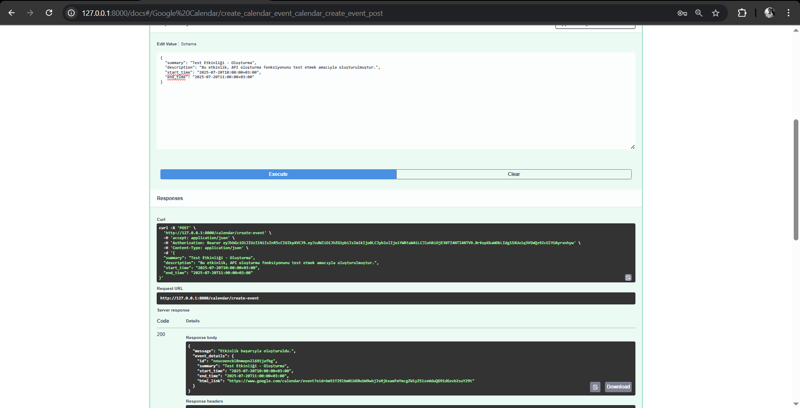
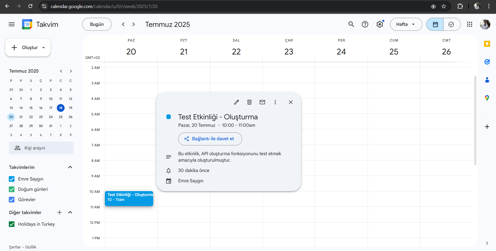
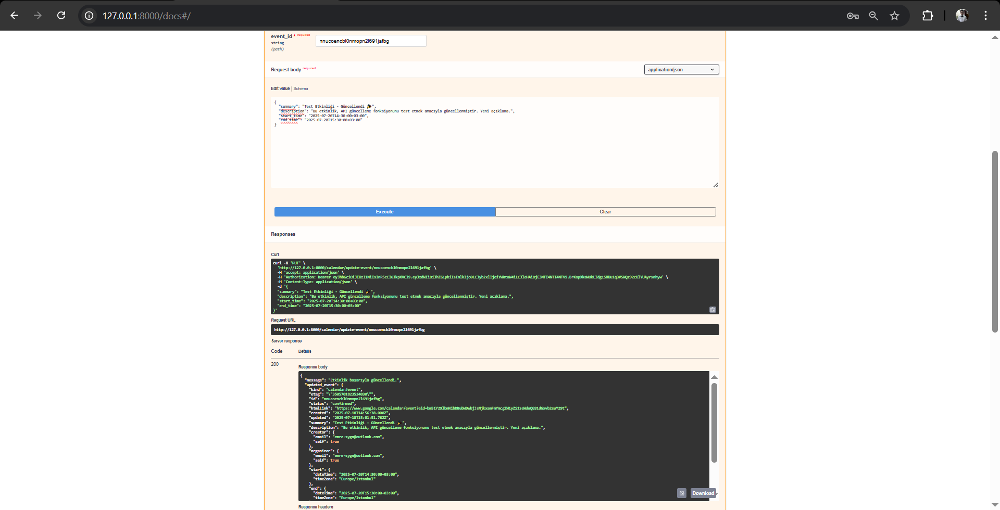
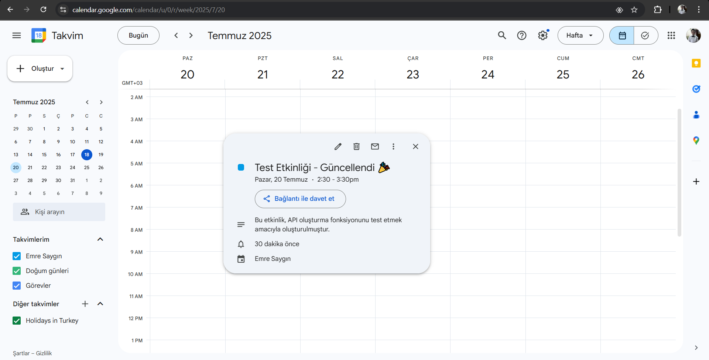
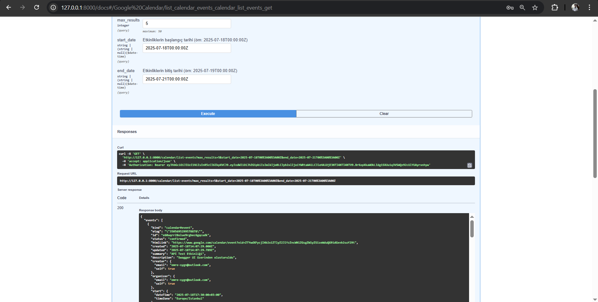
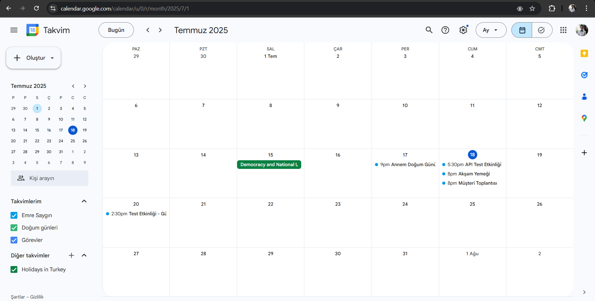
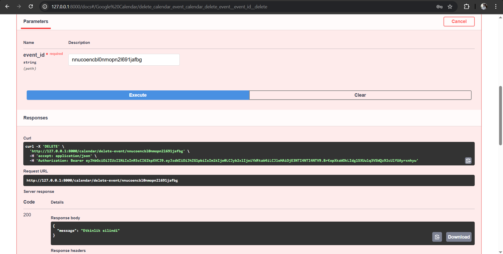
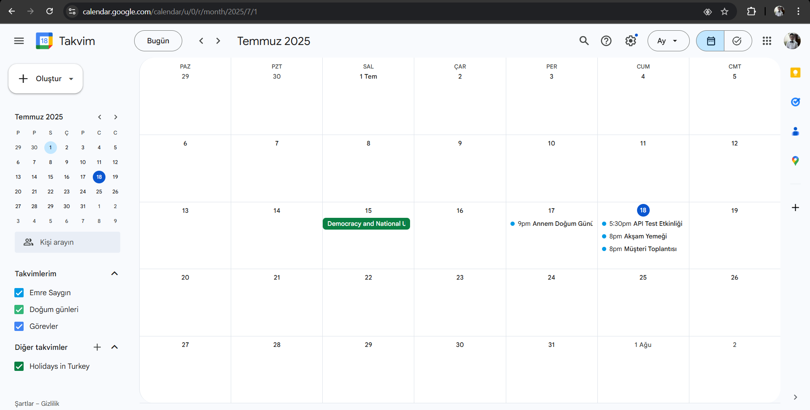

  

# FocusFlow Sprint Raporu 2

---

**Sprint Tarihi:** 07.07.2025/20.07.2025 

**Kullanılan Araç:** **Trello** – [Trello Sprint Board](https://trello.com/b/rYb67cj1/kanban-template)  

**Sprint Hedefi:** 

---

## İçindekiler
- [Sprint Notları](#sprint-notları)
- [Tahmin Edilen Tamamlanacak Puan](#tahmin-edilen-tamamlanacak-puan)
- [Tahmin Mantığı](#tahmin-mantığı)
- [Daily Scrum Notları](#daily-scrum-notları)
- [Sprint Board Durumu](#sprint-board-durumu)
- [Ekran Görüntüleri](#ekran-görüntüleri)
- [Sprint Review](#sprint-review)
- [Sprint Retrospective](#sprint-retrospective)
- [Sprint 2 Planı](#sprint-3-planı)
-----

### Sprint Notları

Bu sprintte, FocusFlow uygulamasının temel mimari altyapısı oluşturulmuş, yapay zeka modül tasarımı tamamlanmış ve kullanıcıların eğitim hedeflerini belirlemesine olanak tanıyan anahtar bileşen geliştirilmiştir.

Başlıca başarılar arasında proje adının "FocusFlow" olarak belirlenmesi, proje logosunun oluşturulması, kullanıcı kimlik doğrulama ve yönetimi arayüzlerinin (Kayıt, Giriş, Ana Sayfa, Dashboard Ana Sayfa) hazırlanması yer almaktadır. Ayrıca, görev yönetimi modülü arayüzleri (Görevler Sayfası, Görev Düzenleme, Görev Ekleme) ve yardımcı modüller (AI Asistanı, Örnek Önerilen Şablonlar) de tamamlanmıştır. Teknik altyapı tarafında ise veri tabanı genel hatlarıyla hazırlanmış ve API istek yapısı örneği gösterilmiştir.

Sprint sürecinde görev kartlarının net biçimde ayrılması ve düzenli Scrum iletişimi olumlu yönler olmuştur. Ancak, bazı görevlerin zaman tahminlerinde eksiklikler yaşanmış ve sınav haftası nedeniyle toplantı düzenlemelerinde zorluklar çekilmiştir. Gelecek sprintler için zaman tahminlerinin ekipçe daha detaylı yapılması ve esnek toplantı saatleri/alternatif iletişim kanalları kullanılması planlanmaktadır.

---

### Tahmin Edilen Tamamlanacak Puan

| No    | Başlık                        | Açıklama                                                        | Öncelik | SP |
|-------|-------------------------------|------------------------------------------------------------------|---------|----|
| PB-01 | AI Eğitim Modülü          | Kişiselleştirilmiş modül yapısını AI ile oluşturma              | Yüksek  | 8  |
| PB-02 | **Günlük Görev Planlayıcı**   | **AI destekli kullanıcı bazlı günlük planlama motoru**              | Yüksek  | **5**  |
| PB-03 | **Takvim Entegrasyonu**           | **Google Calendar API ile entegrasyon**                             | Orta    | **3**  |
| PB-04 | **Görev Hatırlatma Servisi**      | **E-posta ve bildirim sistemiyle hatırlatma**                       | Orta    | **5**  |
| PB-05 | **İlerleme Ölçümü**           | **Görev tamamlama verilerine göre gelişim raporları**               | Yüksek  | **8**  |
| PB-06 | AI Çalışma İpuçları           | Kullanıcıya odak artırıcı öneriler                              | Orta    | 5  |
| PB-07 | Kullanıcı Paneli        | Arayüz, görev yönetimi ve ilerleme ekranı                       | Yüksek  | 8  |
| PB-08 | Sprint Planlama Motoru        | 1 haftalık öğrenme sprintlerinin otomatik planlanması           | Yüksek  | 5  |
| PB-09 | Haftalık Retrospektif         | AI ile sprint sonrası otomatik geri bildirim                    | Düşük   | 3  |
| PB-10 | Hedef Belirleyici             | AI ile kullanıcıdan hedef alıp öneri sunan yapı                 | Orta    | 3  |

Toplam hedeflenen puan: **21 Puan**

  
Hedeflenen Backlog'lar

   ### PB-02
  
  
  ### PB-03
  
  
  ### PB-04
  

  ### PB-05
  
  

> Ekibin kapasitesine göre planlama yapıldı. Önceki denemelerden elde edilen velocity değerine göre 21 puan hedeflendi.

---

### Tahmin Mantığı

Sprint içindeki işin ilerlemesini ve tamamlanan hacmini ölçmek için Story Point metodolojisi kullanılır. Puanlar, bir Ürün Backlog öğesinin göreceli karmaşıklığını, eforunu ve belirsizliğini ifade eden soyut birimlerdir.

---

### Daily Scrum Notları

| Tarih | Gelişme |
|------|---------|
| 21.06 | Proje adı "FocusFlow" ve logonun belirlenmesi üzerinde çalışıldı. Görev dağılımları yapıldı. |
| 23.06 | Kullanıcı kimlik doğrulama arayüzlerinin (Kayıt, Giriş) ilk taslakları gözden geçirildi. Veritabanı şemasının temel yapısı tartışıldı. |
| 25.06 | Ana sayfa ve Dashboard ana sayfa arayüzlerinin geliştirilmesine başlandı. Görev yönetim modülü arayüzleri (Görevler Sayfası) üzerinde ilerleme kaydedildi. API istek yapısı örneği oluşturuldu. |
| 29.07 | Örnek Önerilen Şablonlar arayüzü entegre edildi. Veritabanı entegrasyonu için ilk adımlar atıldı. Ekip üyelerinin sınav haftası nedeniyle toplantı katılımında zorluklar yaşandı, alternatif iletişim kanalları düşünüldü. |
| 02.07 | PB-01 (AI Eğitim Modülü Tasarımı) ve PB-10 (Eğitim Hedefi Belirleyici) üzerinde yoğunlaşıldı. AI modül tasarımının detayları netleştirildi. Geliştirilen arayüzlerdeki ufak hatalar giderildi. |
| 05.07 | Sprint hedeflerine ulaşmak adına son kontroller yapıldı ve tamamlanan işler gözden geçirildi. PB-07 (Kullanıcı Paneli) ile ilgili son düzenlemeler yapıldı. Sprint Review ve Retrospective için hazırlıklara başlandı. |
| 06.07 | Sprint tamamlandı. Tüm hedeflenen backlog maddelerinin (PB-01, PB-07, PB-10) tamamlandığı teyit edildi. Sprint Review ve Retrospective toplantıları gerçekleştirildi ve Sprint 2 planı oluşturuldu.|

---

### Sprint Board Durumu

Bu sprintte tamamlanan Ürün Backlog öğeleri ve bunların projeye katkıları.

| Blaclog ID | Başlık | Tahmini Efor |Durum |
|----------|-------------|-------------|-------------|
| PB-02 | Günlük Görev Planlayıcı | 5 | Tamamlandı |
| PB-03 | Takvim Entegrasyonu | 3 | Tamamlandı |
| PB-04 | Görev Hatırlatma Servisi | 5 | Tamamlandı |
| PB-05 | İlerleme Ölçümü | 8 | Tamamlandı |
| **Toplam** | **21** |

### Ekran Görüntüleri

  
Ekran Görüntüleri

   ### Etkinlik Ekleme Testi
  

  ### Etkinlik Ekleme Testi Sonucu Takvim
  
  
  ### Etkinklik Düzenleme Testi
  

  ### Etkinlik Düzenleme Testi Sonucu Takvim
  

  ### Etkinlik Listeleme Testi
  

  ### Etkinlik Listeleme Testi Sonucu Takvim
  

  ### Etkinlik Silme Testi
  

  ### Etkinlik Ekleme Testi Sonucu Takvim
  

 
  
  

  

---

### Sprint Review

 - **Proje Adı Belirlendi:** Projemizin adı "FocusFlow" olarak belirlendi. Bu isim, projenin ana amacı olan odaklanma ve iş akışı yönetimine vurgu yapmaktadır.
 - **Proje Logosu Oluşturuldu:** FocusFlow için modern ve akılda kalıcı bir logo tasarımı tamamlandı. Logo, projenin özünü yansıtan görsel bir kimlik sağlamaktadır.
 - **Kullanıcı Kimlik Doğrulama ve Yönetimi Arayüzleri:**
   - **Kayıt Sayfası:** Yeni kullanıcıların sisteme kaydolması için gerekli arayüz hazırlandı.
   - **Giriş Sayfası:** Mevcut kullanıcıların sisteme güvenli bir şekilde giriş yapmasını sağlayan sayfa arayüzü hazırlandı.
- **Ana Uygulama Arayüzü:**
   - **Ana Sayfa:** Kullanıcıların uygulamaya giriş yaptıktan sonra karşılaştıkları ana ekran tasarımı hazırlandı.
   - **Dashboard Ana Sayfa:** Kullanıcıların genel durumu ve önemli bilgileri görebileceği ana kontrol panelinin tasarımı hazırlandı.
- **Görev Yönetimi Modülü Arayüzü:**
   - **Görevler Sayfası:** Kullanıcıların mevcut görevlerini listeleyebileceği, görüntüleyebileceği ve yönetebileceği ana sayfanın tasarımı geliştirildi.
   - **Görev Düzenleme:** Mevcut görevlerin detaylarını güncelleyebilme özelliğinin tasarımı hazırlandı.
   - **Görev Ekleme İşlevi:** Yeni görevlerin sisteme girilmesi için gerekli arayüz tamamlandı.
- **Yardımcı Modüller ve Özellikler Arayüzü:**
   - **AI Asistanı:** Kullanıcılara yardımcı olacak bir yapay zeka asistanı arayüzü hazrılandı.
   - **Örnek Önerilen Şablonlar:** Kullanıcıların hızlı başlangıç yapabilmesi için örnek görev veya proje şablonlarının görüntülendiği sayfanın arayüzü hazırlandı.
- **Teknik Altyapı Geliştirmekleri:**
  - **Veri Tabanı:** Uygulamanın veritabanı genel hatlarıyla hazırlandı ve uygulamanın temel veri yapısını ve ilişkilerini gösteren veritabanı şeması hazırlandı.
  - **API İstek Yapısı (Request):** Backend ile frontend arasındaki iletişimi sağlayan API istek yapısının bir örneği gösterildi, bu da veri alışverişi için temel bir yapının mevcut olduğunu gösteriyor.

---

### Sprint Retrospective

Bu sprintin sonunda, ekip olarak neleri iyi yaptığımızı, hangi zorluklarla karşılaştığımızı ve gelecek sprintler için neler öğrenip nasıl iyileşme gösterebileceğimizi değerlendirdik.

**İyi Gidenler:**
- **Kartlar Net Biçimde Ayrılmıştı:** Görev kartlarımızın detaylı ve anlaşılır olması, her ekip üyesinin ne üzerinde çalışması gerektiğini net bir şekilde görmesini sağladı. Bu, iş akışımızı düzenli tutmamıza yardımcı oldu.
- **Scrum İletişimi Düzenliydi:** Yapılan Scrum toplantıları, ekip içindeki iletişimi güçlü tuttu. Karşılaşılan engellerin hızlıca paylaşılması ve çözümlerin birlikte bulunması, sprintin ilerlemesine katkı sağladı.

**Zorluklar:**
- **Bazı Görevlerin Tahmini Eksikti:** Sprint başında bazı görevler için yapılan zaman tahminleri, sürecin ilerleyen aşamalarında yetersiz kaldı. Bu durum, özellikle karmaşık veya daha önce karşılaşmadığımız işlevselliklerde kendini gösterdi.
- **Sınav Haftası Nedeniyle Toplantı Zorlukları Yaşandı:** Ekip üyelerinin aynı zamanda sınav haftasında olması, günlük toplantılarımızı düzenli saatlerde yapma ve tam katılım sağlama konusunda zorluklar yarattı. Bu durum, bazı durumlarda iş birliğini ve hızlı karar alma süreçlerimizi etkiledi.

**Eylem Planı:**
- **Sprint Öncesi Zaman Tahmini Birlikte Yapılacak:** Görevlerin zaman tahminlerini artık sadece bir kişi değil, ilgili ekip üyeleriyle birlikte ve detaylı bir şekilde yapacağız. Bu, tahminlerin daha gerçekçi olmasını ve potansiyel zorlukların önceden belirlenmesini sağlayacak.
- **Esnek Toplantı Saatleri ve Alternatif İletişim Kanalları:** Yoğun dönemlerde, toplantı saatlerini daha esnek hale getirmeyi veya iletişim kanallarını daha etkin kullanmayı değerlendireceğiz. Böylece, kişisel sorumluluklar ile proje sorumlulukları arasında daha iyi bir denge kurulabilecek.

---

### Sprint 3 Planı

- **Hedefler:** 
- **Sprint 3 Backlogları:**
  - **PB-:** 
  - **PB-:** 
  - **PB-:** 

