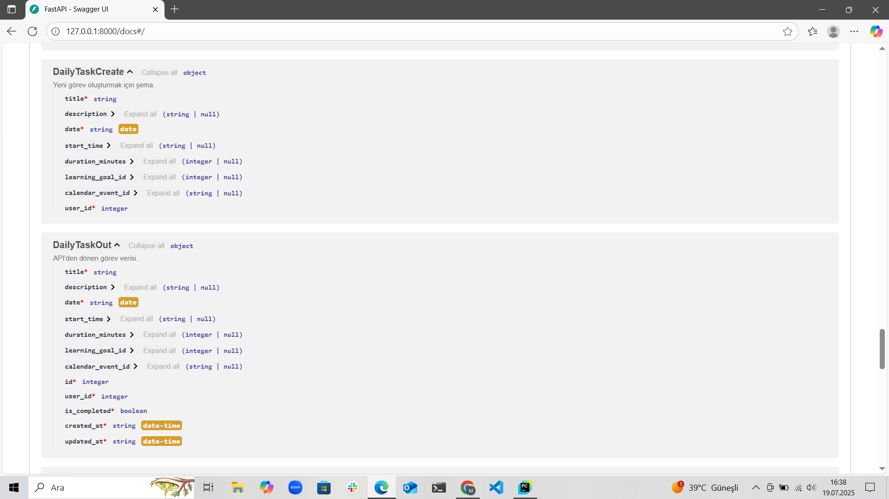

  

# FocusFlow Sprint Raporu 2

---

**Sprint Tarihi:** 07.07.2025/20.07.2025 

**Kullanılan Araç:** **Trello** – [Trello Sprint Board](https://trello.com/b/rYb67cj1/kanban-template)  

**Sprint Hedefi:** Bu sprintte, kullanıcılarımızın üretkenliğini ve öğrenme deneyimini zenginleştirecek kritik fonksiyonlara odaklandık. Temel hedefimiz, bir sonraki aşamalarda daha detaylı ele alacağımız **görev planlayıcı, takvim entegrasyonu ve öğrenme takibi** yeteneklerini geliştirmekti. Bu hedefler doğrultusunda üzerinde çalıştığımız backlog öğeleri ise şunlardır:

- **PB-02: Günlük Görev Planlayıcı**
- **PB-03: Takvim Entegrasyonu**
- **Görev Hatırlatma Servisi**
- **Öğrenme İlerlemesi Ölçümü** 

---

## İçindekiler
- [Sprint Notları](#sprint-notları)
- [Tahmin Edilen Tamamlanacak Puan](#tahmin-edilen-tamamlanacak-puan)
- [Tahmin Mantığı](#tahmin-mantığı)
- [Daily Scrum Notları](#daily-scrum-notları)
- [Sprint Board Durumu](#sprint-board-durumu)
- [Ekran Görüntüleri](#ekran-görüntüleri)
- [Sprint Review](#sprint-review)
- [Sprint Retrospective](#sprint-retrospective)
- [Sprint 2 Planı](#sprint-3-planı)
-----

### Sprint Notları

Bu sprintte, belirlenen temel fonksiyonelliklerin geliştirilmesi üzerine odaklanarak önemli ilerlemeler kaydettik. Her bir backlog maddesi için teknik detaylar ve kaydedilen başarılar aşağıda açıklanmaktadır. Genel olarak, fonksiyonların çoğu arka uçta tamamlanmış olup, ön uç entegrasyonları üzerinde son rötuşlar yapılmaktadır.

- **PB-02: Günlük Görev Planlayıcısı**

**Açıklama:** AI destekli kullanıcı bazlı günlük planlama motoru.

**Durum:** Görev oluşturma, silme, güncelleme ve listeleme için temel CRUD (Create, Read, Update, Delete) fonksiyonları başarıyla geliştirildi. Günlük görevlere yönelik API uçları yazıldı ve AI destekli görev tahmini algoritmasının ilk versiyonu arka uçta tamamlandı. Görevlerin arayüzde gün bazlı görselleştirilmesi ve tamamlama/işaretleme işlevleri için backend altyapısı hazırlandı. Şu an için ön uç entegrasyonu tamamlanmıştır ve tam fonksiyonellik sağlanmıştır.

- **PB-03: Takvim Entegrasyonu**

**Açıklama:** Google Calendar API entegrasyonu ve otomatik görev atama.

**Durum:** Google Calendar API yapılandırması ve OAuth 2.0 kimlik doğrulama süreci sorunsuz bir şekilde tamamlandı. Görevlerin Google Takvim'e işlenmesini sağlayan servis fonksiyonu geliştirildi. Takvim ayarları ekran tasarımı ve hatalı entegrasyon durumlarında kullanıcıya geri bildirim sağlayan mekanizmalar tamamlandı. Ön uç ve arka uç entegrasyonu da tamamlanarak işlevsel hale getirilmiştir.

- **PB-04: Görev Hatırlatma Servisi**

**Açıklama:** Kullanıcılara zamanında hatırlatmalar sunan servis.

**Durum:** Bu backlog maddesi eksiksiz bir şekilde tamamlanmıştır. Görev başlangıcından belirli bir süre önce (örneğin 1 saat) hatırlatma zamanlaması yapısı oluşturuldu. Celery gibi arka plan görev yöneticileriyle entegre çalışan hatırlatma servis modeli geliştirildi. E-posta ve uygulama içi bildirim sistemleri kuruldu, kullanıcıların bildirim tercihlerini (sessize alma, zaman seçimi) ayarlayabilmesi sağlandı. Görevlerle ilişkilendirme ve hatırlatma durumu takibi de başarılı bir şekilde entegre edildi.

- **PB-05: Öğrenme İlerlemesi Ölçümü**

**Açıklama:** Tamamlanan görev verilerine göre gelişim analizi ve raporlama.

**Durum:** Modal tamamlama durumu için veri modeli güncellemeleri yapıldı. Kullanıcının tamamladığı görev/modül/konu bazlı ilerleme oranını hesaplayan servis geliştirildi. İlerleme göstergesi bileşenleri (yüzdelik bar, rozet vb.) hazırlandı ve kullanıcı arayüzüne başarıyla entegre edildi. Veriye dayalı otomatik geri bildirim sistemi ("Bu hafta %X ilerlediniz.") ve motive edici AI yorumları ("Motivasyonunuzu koruyun!") da başarılı bir şekilde devreye alınmıştır.

---

### Tahmin Edilen Tamamlanacak Puan

| No    | Başlık                        | Açıklama                                                        | Öncelik | SP |
|-------|-------------------------------|------------------------------------------------------------------|---------|----|
| PB-01 | AI Eğitim Modülü          | Kişiselleştirilmiş modül yapısını AI ile oluşturma              | Yüksek  | 8  |
| PB-02 | **Günlük Görev Planlayıcı**   | **AI destekli kullanıcı bazlı günlük planlama motoru**              | Yüksek  | **5**  |
| PB-03 | **Takvim Entegrasyonu**           | **Google Calendar API ile entegrasyon**                             | Orta    | **3**  |
| PB-04 | **Görev Hatırlatma Servisi**      | **E-posta ve bildirim sistemiyle hatırlatma**                       | Orta    | **5**  |
| PB-05 | **İlerleme Ölçümü**           | **Görev tamamlama verilerine göre gelişim raporları**               | Yüksek  | **8**  |
| PB-06 | AI Çalışma İpuçları           | Kullanıcıya odak artırıcı öneriler                              | Orta    | 5  |
| PB-07 | Kullanıcı Paneli        | Arayüz, görev yönetimi ve ilerleme ekranı                       | Yüksek  | 8  |
| PB-08 | Sprint Planlama Motoru        | 1 haftalık öğrenme sprintlerinin otomatik planlanması           | Yüksek  | 5  |
| PB-09 | Haftalık Retrospektif         | AI ile sprint sonrası otomatik geri bildirim                    | Düşük   | 3  |
| PB-10 | Hedef Belirleyici             | AI ile kullanıcıdan hedef alıp öneri sunan yapı                 | Orta    | 3  |

Toplam hedeflenen puan: **21 Puan**

  
Hedeflenen Backlog'lar

   ### PB-02
  
  
  ### PB-03
  
  
  ### PB-04
  

  ### PB-05
  
  

> Ekibin kapasitesine göre planlama yapıldı. Önceki denemelerden elde edilen velocity değerine göre 21 puan hedeflendi.

---

### Tahmin Mantığı

Bu sprintteki Story Point tahminlerimiz, bir önceki sprintteki deneyimlerimizden ve velocity değerlerimizden elde edilen derslerle daha da hassaslaştırılmıştır. Her bir backlog öğesinin göreceli karmaşıklığı, geliştirme eforu ve olası belirsizlikleri, takım üyelerinin uzmanlık alanları ve önceki sprintlerde karşılaşılan zorluklar göz önünde bulundurularak değerlendirildi. Özellikle ön uç ve arka uç entegrasyonlarının gerektireceği potansiyel ek iş yükü, tahminlere dahil edilmiştir. Takım içi tartışmalar ve teknik derinlemesine incelemeler sonucunda her task için Story Point'ler belirlenmiştir.

---

### Daily Scrum Notları

| Tarih | Gelişme |
|------|---------|
| 08.07 | PB-05 (Öğrenme İlerlemesi Ölçümü) için temel fonksiyonlarının geliştirilmesine başlandı. PB-03 (Takvim Entegrasyonu) için Google Calendar API yapılandırması üzerinde çalışıldı. |
| 10.07 | PB-02 için API uçlarının yazımı ilerledi. PB-04 (Görev Hatırlatma Servisi) için hatırlatma zamanlaması yapısı ve backend entegrasyonları başladı. |
| 12.07 | PB-03'ün (Takvim Entegrasyonu) Google Takvim'e görev işleme fonksiyonu tamamlandı. PB-05 (Öğrenme İlerlemesi Ölçümü) için veri modeli güncellemeleri ve ilerleme oranı hesaplama servisi geliştirildi. |
| 15.07 | Örnek Önerilen Şablonlar arayüzü entegre edildi. Veritabanı entegrasyonu için ilk adımlar atıldı. Ekip üyelerinin sınav haftası nedeniyle toplantı katılımında zorluklar yaşandı, alternatif iletişim kanalları düşünüldü. |
| 17.07 | PB-02 (Günlük Görev Planlayıcısı) üzerinde yoğunlaşıldı. Takvim tasarımının detayları netleştirildi. Geliştirilen arayüzlerdeki ufak hatalar giderildi. |
| 19.07 | Sprint hedeflerine ulaşmak adına son kontroller yapıldı ve tamamlanan işler gözden geçirildi. Sprint Raporu 2 için ön hazırlıklar yapıldı. Takım içerisindeki çalışmalar göz önünde bulunarak projeye üç kişi devam etme kararı alındı. |
| 20.07 | Sprint tamamlandı. Tüm hedeflenen backlog maddelerinin (PB-02, PB-03, PB-04, PB-05) büyük ölçüde tamamlandığı teyit edildi. Sprint Review ve Retrospective toplantıları gerçekleştirildi ve Sprint 3 planı oluşturuldu.|

---

### Sprint Board Durumu

Bu sprintte tamamlanan Ürün Backlog öğeleri ve bunların projeye katkıları.

| Blaclog ID | Başlık | Tahmini Efor |Durum |
|----------|-------------|-------------|-------------|
| PB-02 | Günlük Görev Planlayıcı | 5 | Tamamlandı |
| PB-03 | Takvim Entegrasyonu | 3 | Tamamlandı |
| PB-04 | Görev Hatırlatma Servisi | 5 | Tamamlandı |
| PB-05 | İlerleme Ölçümü | 8 | Tamamlandı |
| **Toplam** | **21** |

### Ekran Görüntüleri

  
Ekran Görüntüleri

   ### Etkinlik Ekleme Testi
  

  ### Etkinlik Ekleme Testi Sonucu Takvim
  
  
  ### Etkinklik Düzenleme Testi
  

  ### Etkinlik Düzenleme Testi Sonucu Takvim
  

  ### Etkinlik Listeleme Testi
  

  ### Etkinlik Listeleme Testi Sonucu Takvim
  

  ### Etkinlik Silme Testi
  

  ### Etkinlik Ekleme Testi Sonucu Takvim
  

  ### Takvim Aylık Görünüm
  

  ### Takvim Haftalık Görünüm
  
  
  ### Takvim Günlük Görünüm
  

  ### Daily Task Test
  

  ### Email (Hatırlatma)
  

  ### Event Update
  

  ### AI Test 1
  

  ### AI Test 2
  

 
  
  

  

---

### Sprint Review

Sprint İncelemesi toplantısında, paydaşlarımızla bir araya gelerek bu sprintte tamamladığımız temel fonksiyonları ve kaydettiğimiz ilerlemeleri canlı demolarla sunduk. Odak noktamız olan günlük görev planlayıcı, takvim entegrasyonu, görev hatırlatma servisi ve öğrenme ilerlemesi ölçümü modülleri ayrıntılı bir şekilde tanıtıldı.

- **Başarılar ve Öne Çıkanlar:**
  - **Takvim Entegrasyonu (PB-03):** Google Takvim ile sorunsuz entegrasyon ve görevlerin otomatik olarak takvime eklenmesi özelliği, uygulamanın kullanışlılığını artırması açısından olumlu geri bildirimler aldı.
   
  - **Görev Hatırlatma Servisi (PB-04):** Tamamen işlevsel olması ve kullanıcıların bildirim tercihlerini yönetebilmesi, paydaşlar tarafından büyük beğeniyle karşılandı.
    
  - **Öğrenme İlerlemesi Ölçümü (PB-05):** Gelişim çubukları ve otomatik AI yorumları gibi özellikler, kullanıcının motivasyonunu artırma potansiyeli nedeniyle takdir edildi.

- **Alınan Geri Bildirimler ve Öneriler:**
  - **Kullanıcı Arayüzü İyileştirmeleri:** Bazı arayüz elementlerinde küçük estetik dokunuşlar ve daha sezgisel akışlar üzerine öneriler alındı. Özellikle görev planlayıcının (PB-02) görsel sunumu konusunda daha fazla esneklik istendi.

  - **Performans Optimizasyonu:** Özellikle büyük veri setleriyle çalışıldığında takvim entegrasyonunun ve ilerleme ölçümünün yüklenme süreleri hakkında küçük endişeler dile getirildi. Bu, gelecek sprintlerde performans optimizasyonlarına odaklanma ihtiyacını ortaya koydu.

  - **AI Asistanı Entegrasyonu:** Bir önceki sprintte tasarımı yapılan AI Asistanı'nın, bu sprintte tamamlanan modüllerle daha derinlemesine nasıl entegre edilebileceği konusunda fikir alışverişinde bulunuldu. Özellikle görev planlama ve öğrenme tavsiyelerinde AI'ın rolünün artırılması önerildi.

---

### Sprint Retrospective

Bu sprintin sonunda, takım olarak kapsamlı bir retrospektif toplantısı gerçekleştirdik. Bu toplantıda, bu sprintte nelerin yolunda gittiğini, karşılaştığımız zorlukları ve gelecek sprintler için nasıl daha iyi bir performans sergileyebileceğimizi detaylı bir şekilde analiz ettik. Amacımız, sürekli öğrenen ve gelişen bir ekip olmak.

- **Neler İyi Gitti?**
  - **Net Odak ve Hedef Tamamlanması:** Bu sprintte belirlediğimiz görev planlayıcı, takvim entegrasyonu ve öğrenme takibi ana hedeflerine tam olarak ulaşabildik. Takımın tüm backlog maddelerine aynı anda odaklanabilmesi, verimli bir ilerleme sağladı.
  - **Güçlü Takım İçi İletişim:** Daily Scrum'lar ve sürekli iletişim kanalları, ekip üyeleri arasındaki bilgi akışını mükemmel düzeyde tuttu. Karşılaşılan engellerin anında paylaşılması ve çözüm önerilerinin birlikte geliştirilmesi, sprintin sorunsuz ilerlemesinde kilit rol oynadı.
  - **Teknik Borç Yönetimi:** Entegrasyon süreçlerinde ortaya çıkan bazı küçük teknik borçları anında ele alıp çözümleyerek, projenin sağlamlığını koruduk. Bu, gelecekte ortaya çıkabilecek daha büyük sorunların önüne geçti.
  - **Kaliteye Odaklanma:** Teslim ettiğimiz her bir modülde (özellikle PB-04 ve PB-03) yüksek kalite standartlarını korumayı başardık. Hatasız ve kullanıcı dostu arayüzler sunmak, takımın önceliği oldu.

- **Neler Daha İyi Yapılabilirdi?**
  - **Geliştirme Ortamı İstikrarsızlığı:** Sprintin bazı dönemlerinde geliştirme ortamımızda beklenmedik istikrarsızlıklar (örneğin bağımlılık çakışmaları veya yerel kurulum sorunları) yaşandı. Bu durum, bazı takım üyelerinin başlangıçta zaman kaybetmesine neden oldu.
  - **Performans Testlerine Daha Fazla Odaklanma:** Modüllerin fonksiyonel olarak çalışması sağlanırken, özellikle yüksek veri hacimlerinde performans testlerine yeterince zaman ayrılamadı. Bu, gelecekte potansiyel performans darboğazlarına yol açabilir.
  - **Takım Kadrosu Değişikliği:** Sprintin sonlarına doğru takım üyelerimizden birinin katılım eksikliği nedeniyle ekipten ayrılması, gelecek sprintler için mevcut takım kapasitemizi etkileyecek bir durumdur. Bu durum, takımın kalan üyeleri üzerindeki potansiyel iş yükünü artırabilir ve yeni bir denge kurulmasını gerektirebilir.

- **Gelecek Sprint İçin Aksiyon Maddeleri:**
  - **Geliştirme Ortamı İyileştirmesi:** Yeni sprint başlamadan önce, tüm takım üyeleri için ortak ve istikrarlı bir geliştirme ortamı şablonu/rehberi oluşturulacak. CI/CD süreçleri gözden geçirilerek olası istikrarsızlıklar minimize edilecek.
  - **Dokümantasyon Sürecinin Güçlendirilmesi:** Her task'ın tamamlanmasıyla birlikte ilgili teknik dokümantasyonun (API spesifikasyonları, modül açıklamaları vb.) eş zamanlı olarak güncellenmesi zorunlu hale getirilecek. Bunun için task tanımına "Dokümantasyon Güncellemesi" maddesi eklenecek.+
  - **Performans Testleri için Ayrılan Zaman:** Gelecek sprint planlamasında, kritik modüller için belirlenen Story Point'lere performans testleri için ek zaman dilimi eklenecek. Büyük veri setleriyle gerçekçi test senaryoları oluşturulacak.
  - **AI Asistanı Entegrasyon Planı:** PB-01 (AI Eğitim Modülü) ve PB-06 (AI Çalışma İpuçları) gibi AI tabanlı backlog maddeleri için ayrıntılı bir entegrasyon planı ve bağımlılık analizi yapılacak. Bu sayede, AI'ın yeni modüllerle uyumu optimize edilecek.
  - **Kalan Entegrasyonların Tamamlanması:** Bu sprintte tam olarak bitirilemeyen front-end ve back-end entegrasyon işleri, gelecek sprintin öncelikli görevleri arasına alınacak ve tamamlanması sağlanacak. Bu görevler için özel bir takip mekanizması oluşturulacak.
  - **Takım Kapasitesinin Yeniden Değerlendirilmesi:** Bir takım üyesinin ayrılması nedeniyle, Sprint 3 için takımın mevcut kapasitesi ve velocity değeri yeniden değerlendirilecek. Yeni iş dağılımı ve görev atamaları yapılırken bu durum göz önünde bulundurulacak ve gerekirse gelecek sprintin scope'u yeniden düzenlenecek.

---
 
### Sprint 3 Planı

Bu sprintte elde edilen kazanımlar ve retrospektif sonuçları ışığında, bir sonraki sprint olan Sprint 3 için hedeflerimiz ve öncelikli backloglarımız aşağıdaki gibidir:

Takımımızın bir üyesinin ayrılması nedeniyle, Sprint 3'teki iş yükü dağılımımızı ve Story Point hedeflerimizi mevcut takım kapasitemize göre yeniden gözden geçireceğiz. Bu durum, odaklanmamız gereken backlog maddelerini daha dikkatli seçmemizi gerektirecektir.

- **Hedefler:** Kullanıcıların öğrenme hedeflerini daha detaylı belirleyebilmesi, AI destekli kişiselleştirilmiş öğrenme modüllerinin aktif hale getirilmesi ve genel uygulama performansının iyileştirilmesi.

- **Sprint 3 Backlogları:**
  - **PB-06: AI Çalışma İpuçları Sistemi** 
  - **PB-08: Sprtint Bazlı Planlama Motoru** 
  - **PB-09: AI Destekli Haftalık Retrospektif** 

